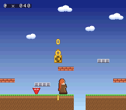
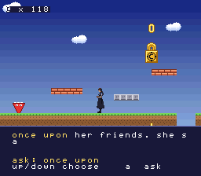

# elya-snes

A transformer language model that runs on a stock Super Nintendo — no
enhancement chip, no SuperFX, no DSP — inside a platformer that stops halfway
through and starts talking to you.

```
who are you?       ->  i am elya.
what are you?      ->  a small model.
the coins?         ->  one is a token.
are you a table?   ->  no. i can err.
```

and, asked in phrasings she was never trained on:

```
what of scott?     ->  my maker.
where do you sit?  ->  on the cart.
and the block?     ->  a multiply.
and trust?         ->  check the coins.
```

**102,400 ternary weights**, 54,830 of them non-zero, 4-bit activations, a
64-symbol vocabulary, three layers, two heads, 20 positions of context, trained
with quantisation-aware training so the forward pass the trainer saw is the
forward pass the 65816 executes. **6.88 tokens per second** on a 2.68 MHz Ricoh
5A22, 7.85 on FastROM. Verified against an exact-integer host reference over
**1,280 tokens — every vocabulary symbol as a seed — on both clock arms**, plus
the residual stream and the attention output element by element.

She knows **70 facts**, asked **729 ways**, and answers **33.6% ± 2.8 of
held-out paraphrases** as one model — **52.9% ± 2.4** through five topic shards
and a keyword router, which is measured on the host and is not yet in the ROM.
Those are five-seed arm means, which are the honest numbers; this README is not
going to quote the best of five.

She was not always able to. The first cartridge was trained on TinyStories and
answered every question with a fragment of a children's story — `who are you?`
got `make a big p`. Entry 10 retrained her on 34 facts with two phrasings each,
which taught her 68 strings: 97.4% on those and **13.1% on paraphrases of the
same questions**. Entry 11 fixed that without an architecture change — the same
34 facts asked 345 ways: **12.6% ± 1.4 → 21.7% ± 2.9 from the corpus alone**,
and 30.3% ± 1.4 once the training recipe followed it. Entry 12 doubled the
facts, and the honest summary of that is two numbers rather than one: on the
identical 137 held-out questions the routed score goes **56.2% → 60.0%**, while
on the 112 of them the corpus change did not target it goes **68.0% → 58.2%**.
She knows twice as much and is worse at part of what she already knew, because
102,400 ternary weights are a fixed budget.

Every number in [FINDINGS.md](FINDINGS.md) is measured on the console. Nothing
is estimated.

She free-runs into her own questions when nothing prompts her, which is what
act 1 and act 2 do. These are what `out/nnsurvey.ram` holds and what the
reference prints for seeds `b`, `d`, `q`, `w`:

```sh
NES_T=20 python3 train/sample.py model/elya_qa_para_s2.npz --seeds 1,3,16,22 --n 19
#  b -> 'but i do get wrong.'     d -> 'do you ream? no. i guess.'
#  q -> 'quite slow, this chip.'  w -> 'wait. i would talk.'

python3 train/eval_answers.py model/elya_qa_para_s2.npz  # the answer-quality gate
```

```sh
make nn      # the engine cartridge (out/nn.sfc, out/nnfast.sfc)
make game    # the game cartridge  (out/game.sfc, out/gamefast.sfc)
make gate    # build every variant, run under ares, check every token
make kernels # the gather-kernel A/B
make measure # the arithmetic-primitive tables
```

---

## The game

Three acts on one cartridge. A logo, a platformer, and a conversation.

Elya runs right, jumps, and strikes a block stamped `@` — the matrix-multiply
operator, because `A @ B` is what makes the tokens the block gives out. A `∇`
chases her: the gradient operator, which is funny because the ROM does
inference and contains no gradients at all, so it is the thing from training
that cannot touch her any more, still chasing. The sky is an HDMA gradient and
the clouds are a scrolling background layer.

Then she stops, the nabla loses interest and wanders off, the camera tilts up,
and she says something the cartridge generated on the spot.

### The rule the whole thing is built around

> **A coin may only be spawned from the code path that commits a generated
> token.** Not a timer. Not a frame counter.

So the coin count is a *countable* proof of inference: pause the video and
check coins against characters, trusting no number the ROM prints. It is
enforced structurally — `gcommit` is the only writer of the coin queue and the
vblank spawner is the only reader — and proved three ways:

```
final counters           118 spawned + 0 queued == 118 committed
every trace sample       104/104 samples satisfy the same identity
-DNOGEN, forward pass removed, nothing else changed
                         1,707 frames, 0 tokens, 0 coins
```

If inference stalls, the coins stall.

### What it costs, and it is not nothing

The main thread is the transformer and nothing else; the vblank NMI is the
entire game. The inference path only ever stores a token, bumps two counters
and pushes one byte into a ring — no PPU register, no formatting, no VRAM.

```
                   engine only    with the game     delta
SlowROM 2.68 MHz     7.030 tok/s     5.634 tok/s   -19.9%
FastROM 3.58 MHz     8.019 tok/s     6.412 tok/s   -20.0%
```

**A fifth of the arithmetic went to making it a game.** The two arms agree on
something more useful than the percentage: converted to cost *per frame* the
presentation is 70,937 master clocks on SlowROM and 71,606 on FastROM — 0.9%
apart. A frame of game is a frame of game whatever the CPU clock is, because
the game layer is DMA and WRAM traffic and `MEMSEL` touches neither.

Of that, 61,302 clocks a frame (17.2%) are measured *inside* the NMI handler,
8,314 (2.3%) are the sky's HDMA channel — isolated by building the same
cartridge with it switched off — and 1,321 are everything else. The design
document called the HDMA sky "zero CPU cycles"; it is 2.33% of the model's
throughput. Small, real, not zero.

### Seeing it, on a machine that cannot take a screenshot

Screen capture does not work here (GNOME/Wayland, no `wlr-screencopy`). So the
ROM reads its own OAM, VRAM and CGRAM back out **through the PPU** into battery
SRAM, and `tools/render_frame.py` composites them on the host into exactly what
the television would show.

That is better than a screenshot rather than a substitute for one: a screenshot
is a picture you have to trust the emulator's renderer for; this is the object
table, the tilemaps, the palettes and the scroll registers the picture would be
made from, composited in code you can read. It also checks itself —

```
BG3 tilemap read back through $2139 == the WRAM shadow   1024/1024 entries
OAM read back through $2138        == the DMA'd shadow    544/544 bytes
CGRAM 1..11, 32..47, 48..63, 128..143 == the palette files, byte for byte
```




### The conversation

Context is 20 positions because the trained positional table has twenty rows,
so the six questions are chosen short — a ten-token question leaves ten tokens
for the answer. The question is *stored* (a prompt is input, not output) and is
drawn in amber; what the console generated is drawn in white. **The screen
itself shows which characters came out of the model.**

```
'what are you? '  ->  'a small model. '     14/14 identical to host/ref.py
'the coins? '     ->  'one is a token.  '   14/14 identical to host/ref.py
```

Act 2's line has no stored prompt at all: it is generated from the last token
act 1 produced, so it depends on how the platformer went. On the recorded run
act 1 ended on `.` and she said `'t chip? the snes.'` — half a question she was
never asked, answered. A lookup table cannot make that mistake.

The six she is asked are filtered against the shipped weights by
`train/pick_menu.py`: inside the ten-token prompt cap, and reproduced exactly
by `host/ref.py`. She gets all six right on the host and the cartridge
reproduces the host token for token.

---

## Three results

### 1. int8 does not beat ternary on the SNES. The prediction is refuted.

This port opened with a prediction: the SNES is the first target in this family
with a fast **signed** hardware multiply, so it should be where int8 finally
wins. Primitives were measured before any engine was written.

Wall master clocks per multiply-accumulate (21.477 MHz master clock):

| primitive | SlowROM | FastROM | vs ternary |
|---|---:|---:|---:|
| software 8x8 shift-add | 1503.9 | 1327.2 | 13.8x |
| quarter-square tables | 570.9 | 467.6 | 5.2x |
| DSP-1, bus transfer only¹ | 323.5–476.1 | 267.9–391.7 | 3.0–4.4x |
| PPU Mode 7, textbook form | 333.8 | 274.1 | 3.1x |
| CPU multiply `$4202`/`$4203` | 317.3 | 261.8 | 2.9x |
| **PPU Mode 7, tuned** | **220.5** | **179.2** | **2.0x** |
| CPU multiply, operands pre-packed² | 164.8 | 136.0 | 1.5x |
| **ternary sign-separated gather** | **109.2** | **86.5** | **1.00x** |

¹ lower bound: the DSP-1 firmware is unavailable, so no DSP execution time and
no RQM polling is included. ² lower bound: needs two runtime arrays interleaved
into one, which costs more than the MAC it saves.

**The multiply was never the variable.** The Mode 7 unit produces a signed
16x8 product in zero cycles; all 214 cycles of that arm are data movement.

> Ternary touches **three** memory locations per accumulate. int8 touches
> **six**.

That one mechanism replaces the per-platform story these ports had been
telling. Ternary's advantage shrinks as a machine gets better at moving
operands, and inverts on one that fetches eight at a time:

| arm | ternary advantage |
|---|---|
| SNES 5A22 SlowROM | 2.02x |
| SNES 5A22 FastROM | 2.07x |
| SNES SuperFX GSU (emulator only) | 1.27x |
| N64 RSP vector unit (sibling port) | inverts — int8 wins |

Also measured, because it is usually asserted: the Mode 7 multiplier's
"vblank only" reputation costs **nothing** here. With the screen genuinely on
in BG mode 1 during active display, the same MAC measures 220.5 against 220.5
in forced blank.

### 2. The cheapest gather is no gather — and the NES's 8-bit finding splits in two

Seven gather kernels, same instrument, same operands, each separately proved to
compute the right sum. Wall master clocks per MAC:

| kernel | SlowROM | FastROM | what it is |
|---|---:|---:|---|
| **code** | **32.98** | **28.84** | the index in the accumulate's operand byte |
| codesgn | 33.09 | 28.95 | the same, sign separated — what ships |
| code8 | 36.26 | 30.16 | the same, 8-bit accumulator + fold |
| i8dp16 | 72.11 | 59.76 | 8-bit index regs, 16-bit accumulator |
| i8acc | 74.28 | 60.13 | 8-bit index regs, 8-bit accumulator |
| i16dp | 86.52 | 72.09 | 16-bit index regs, direct-page activations |
| i16abs | 94.80 | 78.29 | 16-bit index regs, absolute activations |

The weights are static and the SNES has a 24-bit address space, so the gather
index does not need to be *fetched*: it can live in the operand byte of the
accumulate itself. A row becomes `lda #K`, a run of `adc <off`, `sec`, a run of
`sbc <off`. **2.18x cheaper than the best data-driven gather, 3.30x cheaper
than the primitive in the table above**, for 2 bytes of ROM per non-zero
weight. On the NES, where the whole cartridge is a 32 KB window, that trade is
not available.

The NES port found that 8-bit register residency was the whole driver of its
inner-loop cost. On the 65816 that **splits**: the index registers want to be
narrow (`abs,y` with a 16-bit index costs an unconditional extra internal cycle
and one more fetch — 20% cut) and the accumulator wants to be **wide** (a
byte-wide accumulator must be folded into a 16-bit total every 16 elements, and
the fold costs more than the byte-wide `adc` saves). The 6502 has one width and
could not separate the two questions.

### 3. Generalisation was a corpus problem, and every architecture lever had already been spent

She memorised her training questions. Asked the same fact a way she had not
been asked, she was wrong six times out of seven: **97.4% on the 68 strings she
was trained on, 13.1% on paraphrases of them.**

Entry 10 had already run the architecture levers and they were all spent — the
learned positional table made held-out paraphrase three times *worse* here, four
routing constructions were indistinguishable from random, and sixteen times the
weights bought 0.0071 nats and cost sixteen points of exact answers. What was
left was the data: 34 facts with two phrasings each is 68 examples, and 68
examples cannot teach *the answer depends on what is being asked and not on
which exact tokens arrived*.

Same 34 facts, same answers, asked **345 ways** — 208 trained, 68 held out for
choosing, 69 held out and not read until the choice was made. Held-out sets hold
out **phrasings**, not facts, because asking a model about something it was
never told measures nothing. Five seeds per arm, on the identical 35 questions
entry 10 held out:

| | train | the same 35 paraphrases |
|---|---:|---:|
| 68 pairs, entry 10's recipe | 97.4% ± 0.6 | 12.6% ± 1.4 |
| 345 pairs, entry 10's recipe | 98.1% ± 0.6 | **21.7% ± 2.9** |
| 345 pairs, recipe tuned on dev | 100.0% ± 0.0 | **30.3% ± 1.4** |

On the larger held-out set the tuned arm reaches **38.0% ± 3.7**.

Three things fell out of the grid that are worth more than the headline:

* **`--qw`, the loss weight on the QUESTION positions, is the biggest single
  lever in it and costs nothing at run time.** At full weight the model spends
  capacity predicting the next token of a question it is being handed anyway —
  208 strings of pure memorisation competing with the answers for 102,400
  ternary weights. A quarter weight is worth nine points of held-out paraphrase
  and changes no shape and no weight count.
* **Dev predicts test across arms (r = +0.741) and not within one (r = −0.550
  over five seeds).** So choose the arm on dev and do not choose the seed:
  68 questions is ±6 points of binomial noise, which is the whole spread.
* **Topic sharding wins by 23.9 points** — five narrow models, one per topic,
  scored on the same held-out questions: 38.0% → **61.8%**, ahead on all five
  topics. That reproduces the sibling Genesis port's load-bearing finding on
  different hardware. It is measured and **not shipped**: it assumes a router
  the cartridge does not have. It is also, unlike entry 10's 64-expert mixture,
  affordable — five whole models measure 0.63 MiB of straight-line 65816 against
  a 4 MB LoROM ceiling.

---

## The cartridge

| | |
|---|---|
| image | 256 KiB LoROM, NTSC, battery SRAM, no coprocessor |
| weight program | 4 banks of straight-line 65816, 54,830 accumulates |
| ROM == host | 1,280/1,280 tokens over 64 seeds, both clock arms |
| internals | 960/960 residual-stream and attention values, 3 positions |
| cycles/token | 3,120,767 wall master (SlowROM) · 2,735,965 (FastROM) |
| tokens/s | **6.882** (SlowROM) · **7.850** (FastROM) |
| with the game layer | 3,890,925 · 3,420,202 → **5.520** · **6.280** tok/s |
| where the time goes | matmul 68.9% · attention 27.7% · embed+head 3.5% |

**FastROM buys 14%, not 33%**, because the engine's operands live in WRAM and
WRAM is 8 master clocks whatever `MEMSEL` says.

**Speed on this cartridge is a function of DENSITY and of nothing else**, because
a non-zero weight is an accumulate instruction in a straight-line weight
program and it has to execute. The story model quantised to 52,764 non-zeros
and ran at 7.030 tok/s; entry 10's conversational model left 55,798 and ran at
6.813; the paraphrase model leaves 54,830 and runs at 6.882. Nobody asked the
trainer for a density and it was never given a reason to prefer one; `--tau` is
the knob if a few per cent ever matters more than a few answers.

The cartridge writes its tokens to battery SRAM, which is how results leave the
console: ares autosaves it to `<rom>.ram` and the host reads the file. The
engine image (`out/nn.sfc`) runs in forced blank and draws nothing; the game
image (`out/game.sfc`) draws, and proves what it drew by reading the PPU back
into the same SRAM.

## Targets

* **stock 5A22** — the primary target, and what everything above measures. Runs
  on a Kaico Super DSP V3.1 flashcart: LoROM, NTSC, 2 Mbit of a 56 Mbit
  cartridge, battery SRAM declared, **no enhancement chip**. Checked from the
  image's own bytes by `tools/kaico_check.py`.
* **DSP-1** — measured and rejected. Its most optimistic floor, 314 CPU master
  clocks per MAC of pure bus transfer with no DSP execution time at all, is
  already 1.5x worse than the PPU multiplier and 3x worse than ternary.
* **SuperFX** — **emulator only**; the Kaico cart has no GSU. Measured as a
  controlled A/B anyway, because it is the cleanest architecture comparison
  available: same console, same bus, one variable changed.

## What is not done

* **No real hardware.** Everything here is measured under ares, whose SNES core
  is bsnes-derived — the accurate lineage — and whose timing model this repo
  calibrated against hand-derived 65816 timings to 0.06%. That is not the same
  as a cartridge in a console. `tools/kaico_check.py` says the image is *valid*
  for the Kaico Super DSP; it does not say it has run on one.
* **Nobody has watched the game on a screen.** Screen capture does not work on
  this development host, so what it looks like is reconstructed from OAM, VRAM
  and CGRAM read back through the PPU and composited on the host. Every byte in
  that reconstruction came off the console, and it caught two bugs no counter
  could have — but it is a reconstruction, and it renders one frame rather than
  motion. Nothing here says the animation looks right at 60 Hz.
* **Elya is a placeholder.** The generated sprites are not canon — they face
  left, wear a maid's apron and the hair came out dark instead of auburn-red —
  so they are not built. `tools/mkart.py` emits a canon-correct placeholder and
  says so on every build, and `docs/ART_SPEC.md` carries the character sheet as
  a normative section. A ROM with a placeholder in it is honest; a ROM with the
  wrong character in it is not.
* **No audio.** The design's act 2 beat is "the music drops out", and there is
  no music to drop. Uploading an SPC700 program through the APU IPL handshake
  is a day's work on its own and none of it would be verifiable here, since
  this host has no way to hear the result. A driver that cannot be checked is
  not something this repo ships.
* **Held-out paraphrase is 38.0% ± 3.7 and the shipped seed gets 31.9%.** The
  arm was chosen on a dev set; the seed within it was not, because selecting a
  seed on 68 questions is measurably noise. The arm mean is the estimate, and
  the shipped cartridge is one draw from it rather than the best of five.
* **Two held-out questions cannot be answered at all.** `why not run? ` and
  `a game now? ` need 21 positions and the machine has 20. They are counted as
  misses, which biases the held-out number down rather than up.
* **Topic sharding is measured and not shipped.** 61.8% assumes a router that
  always picks the right shard, and there is no router in `rom/nn.s`. Shipping
  it means a new linker config, `tools/emit.py` emitting five models into
  banks, `rom/game.inc` choosing one from the question, and the whole
  fifteen-arm gate re-run against it.
* **She knows 70 facts and they cost her.** Doubling the corpus is worth
  +3.8 points of routed answers on the frozen held-out set and **-9.8 on the
  part of it the change did not target**; train-exact falls from 100% to 94%.
  At 30 symbols and 20 positions the answers cannot be much longer, and at
  102,400 ternary weights the facts cannot be many more without something
  giving. Every fact she states is checkable against this repo.
* **Context stops at 20 positions**, because the positional table the model was
  trained with has twenty rows. The KV caches on this port would hold far more —
  they are 4 KiB and 5 KiB of a 128 KiB WRAM — so the ceiling here is the
  weights, not the machine. The 6502 port's ceiling was the opposite.
* **The row overhead is the largest thing left unoptimised.** 446 wall master
  clocks per row on top of the accumulates, or 36% — the `JSL`/`RTL` pair and
  the quantise-and-store handler. Inlining the handler would cost about 56 KiB
  of ROM to buy back perhaps 8% of a token.
* **The DSP-1 was never executed**, only bounded: its firmware is not available
  on this machine and cannot be synthesised. The bound is enough to rule it out
  (entry 4) but it is a bound.
* **The AV_SHIFT ladder is a deterministic reproduction**, not an independent
  re-measurement — see entry 8, which says so plainly.

Sibling ports: [elya-nes](https://github.com/Scottcjn/elya-nes) ·
[legend-of-elya-genesis](https://github.com/Scottcjn/legend-of-elya-genesis) ·
[legend-of-elya-n64](https://github.com/Scottcjn/legend-of-elya-n64) ·
[gbc-transformer](https://github.com/Scottcjn/gbc-transformer)

## How it is measured

ares has no scripting, so the counter is on the console: latch the PPU H/V
counters (`$2137` → `$213C`/`$213D`), run the work, latch again. Resolution 4
master clocks. A token spans eight frames, so `-DPROFILE` adds a vblank counter
kept by the NMI and stitches the two together — and **measures** the frame
length rather than assuming 262 x 1364, which incidentally reconfirms the
DRAM-refresh model to 0.03%.

The instrument was calibrated against hand-derived 65816 timings before any
number was quoted (five bodies, all within **0.06%**), and it lied twice before
it worked. Both lies and both fixes are in [FINDINGS.md](FINDINGS.md), along
with the three bugs the engine shipped through — including the one where a
64-seed survey passed while the single-seed build was seeding itself from
uninitialised WRAM.
